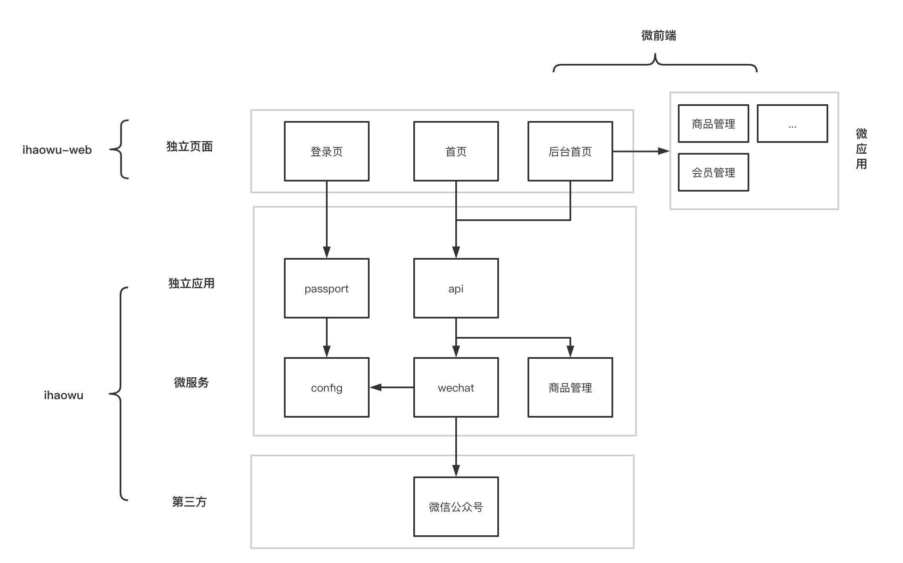

# iHaowu - 爱好物

> 工作中～

基于 [nestjs] 的微服务架构搭建的在线商城服务端


## 架构设计



粗略设计，项目分成 [ihaowu](https://github.com/ihaowu/ihaowu)， `ihaowu-web` 和  `ihaowu-mobile`，都采用 **monorepo** 进行管理，整体结构保持一致。

**后端技术栈**

- [nestjs] - web 框架
- [prisma](http://prisma.io/) - 数据库工具
- **微服务** 架构


**前端技术栈**

- [vue3](https://v3.vuejs.org/) - web 框架
- [react](https://zh-hans.reactjs.org/) - web 框架
- [lit-element](https://lit-element.polymer-project.org/) - web 框架
- **多页** + **微前端** 架构

暂不考虑 `angular`，不是歧视，而是真没精力学了😭。

**APP 技术栈**

[flutter](https://flutter.dev/) 或 [capacitorjs](https://capacitorjs.com/)？

还没想好，其他的也没精力了。。。

**flutter** 热度高，但架不住 web 越来越开放，**capacitorjs** + **web api** 天生和 js 很搭配。

> 作者语：其实两个都没这么学，都不好，哈哈哈哈哈

## 目录结构

`apps` 目录下都是独立的应用，拥有独立的端口号，`microservices` 下是微服务，启动不占用端口，`packages` 下是公共的模块，后期会发布到 **npm** 上，是应用和微服务都会依赖的公共模块。

```bash
Project/
├── .vscode/         - vscode 编辑器配置目录
├── apps/
|   ├── api/                 --- api 网关
|   └── passport/            --- 通行证服务
├── microservices/
|   ├── config/              --- 配置中心
|   └── wechat/              --- 微信公众号
├── packages/
|   └── nestjs-utils/        --- nestjs 应用工具模块
├── lerna.json               --- lerna  配置文件
├── nest-cli.json            --- @nest/cli 配置文件
├── tsconfig.base.json       --- 通用基础配置
├── tsconfig.json            --- typescript 配置
└── vscode.code-workspace    --- vscode 工作区配置
```

## 文档

想要启动本项目的，请查看 **快速开始** 的文档。

- 新手指南
  - 微服务是什么？
  - [快速开始](./docs/intro/quickstart.md)
- 项目管理
  - [lerna][lerna]
  - [yarn workspaces][yarn workspaces]
  - `nestjs` 的 [monorepo-mode][monorepo-mode]
  - [Project References][Project References]


## License

- MIT

[lerna]: https://lerna.js.org/
[nestjs]: https://nestjs.com/
[yarn workspaces]: https://classic.yarnpkg.com/en/docs/workspaces/
[Project References]:https://www.typescriptlang.org/docs/handbook/project-references.html
[monorepo-mode]: https://docs.nestjs.com/cli/monorepo#monorepo-mode
